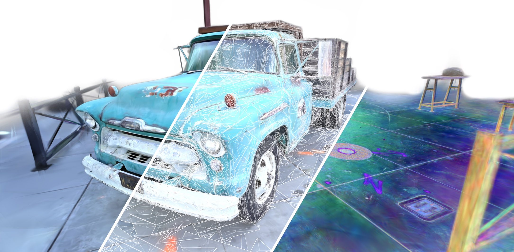

<!--
SPDX-FileCopyrightText: Copyright (c) 2026 NVIDIA CORPORATION & AFFILIATES. All rights reserved.
SPDX-License-Identifier: Apache-2.0
-->

<div align="center">

# Neural Harmonic Textures for High-Quality Primitive Based Neural Reconstruction

[Jorge Condor](mailto:jorge.condor@usi.ch)<sup>1,2</sup>,
[Nicolas Moenne-Loccoz](mailto:nicolasm@nvidia.com)<sup>1</sup>,
[Merlin Nimier-David](mailto:mnimierdavid@nvidia.com)<sup>1</sup>,
[Piotr Didyk](mailto:piotr.didyk@usi.ch)<sup>2</sup>,
[Zan Gojcic](mailto:zgojcic@nvidia.com)<sup>1</sup>,
[Qi Wu](mailto:qiwu@nvidia.com)<sup>1</sup>

<sup>1</sup>NVIDIA
<sup>2</sup>Universit&agrave; della Svizzera italiana, Lugano, Switzerland &nbsp;&nbsp;

[[Paper]](https://research.nvidia.com/labs/sil/projects/neural-harmonic-textures/assets/neural_harmonic_textures.pdf) &nbsp;
[[Project Page]](https://research.nvidia.com/labs/sil/projects/neural-harmonic-textures/) &nbsp;
[[Video]](https://research.nvidia.com/labs/sil/projects/neural-harmonic-textures/videos/video_nht_titleless.mp4)



</div>

---

## Abstract

Primitive-based methods such as 3D Gaussian Splatting have recently become the state-of-the-art for novel-view synthesis and related reconstruction tasks. Compared to neural fields, these representations are more flexible, adaptive, and scale better to large scenes. However, the limited expressivity of individual primitives makes modeling high-frequency detail challenging.

We introduce *Neural Harmonic Textures*, a neural representation approach that anchors latent feature vectors on a virtual scaffold surrounding each primitive. These features are interpolated within the primitive at ray intersection points. Inspired by Fourier analysis, we apply periodic activations to the interpolated features, turning alpha blending into a weighted sum of harmonic components. The resulting signal is then decoded in a single deferred pass using a small neural network, significantly reducing computational cost.

Neural Harmonic Textures yield state-of-the-art results in real-time novel view synthesis while bridging the gap between primitive- and neural-field-based reconstruction. It can be interpreted as a Lagrangian alternative to positional encoding in neural fields.

---

## Installation

### Prerequisites

| Component | Requirement |
|---|---|
| **Python** | >= 3.8 |
| **PyTorch** | >= 2.0 with CUDA support |
| **CUDA** | >= 12.0 (required for tiny-cuda-nn cooperative vectors) |
| **GPU** | Ada Lovelace or newer recommended (RTX 4090, A6000 Ada, L40, etc.); Ampere GPUs (A100, RTX 3090) also work |

### Quick setup

Requires [uv](https://docs.astral.sh/uv/getting-started/installation/) (will auto-download Python 3.11 if needed).

```bash
# Clone with submodule
git clone --recursive https://github.com/nv-tlabs/neural-harmonic-textures.git

# Run the setup script (Linux)
cd neural-harmonic-textures
bash setup.sh
source .venv/bin/activate
```

```powershell
# Windows (PowerShell)
git clone --recursive https://github.com/nv-tlabs/neural-harmonic-textures.git
cd neural-harmonic-textures
.\setup.ps1
.\.venv\Scripts\Activate.ps1
```

> **Windows note — Visual Studio Build Tools required:**
> Building the CUDA extensions (gsplat, fused-ssim, tiny-cuda-nn) requires the MSVC C++ compiler (`cl.exe`).
> Install [Visual Studio 2022](https://visualstudio.microsoft.com/downloads/) with the **"Desktop development with C++"** workload.
>
> `setup.ps1` will automatically try to locate your Visual Studio installation and set up the
> build environment. If auto-detection fails, you will need to load the VS environment manually
> before running setup. Either:
>
> 1. Open **"x64 Native Tools Command Prompt for VS 2022"** from the Start Menu, then run `powershell` and `.\setup.ps1`, or
> 2. Source the VS environment in your existing PowerShell session before running setup:
>
>    ```powershell
>    # Adjust the path for your VS edition (Enterprise / Professional / Community)
>    & "C:\Program Files\Microsoft Visual Studio\2022\Enterprise\Common7\Tools\Launch-VsDevShell.ps1" -Arch amd64
>    .\setup.ps1
>    ```

### Manual setup

```bash
git clone --recursive https://github.com/nv-tlabs/neural-harmonic-textures.git
cd neural-harmonic-textures
uv venv --python 3.11 .venv && source .venv/bin/activate

# Build dependencies + PyTorch (adjust --index-url for your CUDA version)
uv pip install "setuptools==78.1.1" wheel ninja numpy rich
uv pip install torch==2.9.1 torchvision==0.24.1 --index-url https://download.pytorch.org/whl/cu126

# Install gsplat from submodule (needs torch at build time)
uv pip install --no-build-isolation -e ./gsplat

# Install the aov helpers package and remaining dependencies
uv pip install --no-build-isolation -e .
uv pip install --no-build-isolation -r gsplat/examples/requirements.txt
```

### Dataset

Download the [MipNeRF 360](http://storage.googleapis.com/gresearch/refraw360/360_v2.zip) dataset and extract it under `data/`:

```bash
bash scripts/download_data.sh
```

Your directory layout should look like:

```
data/
  mipnerf360/{garden,bicycle,stump,bonsai,counter,kitchen,room,...}
```

---

## Quick Start

### Training

```bash
# Train on the garden scene (MipNeRF 360, outdoor, factor 4, 1M primitives)
bash scripts/train.sh

# Train on kitchen (indoor, factor 2)
bash scripts/train.sh --scene kitchen --data_factor 2

# Train with 2M primitives
bash scripts/train.sh --scene bonsai --data_factor 2 --cap_max 2000000
```

```powershell
# Windows
.\scripts\train.ps1
.\scripts\train.ps1 -Scene kitchen -DataFactor 2
```

### Viewing

```bash
# Launch the interactive viewer
bash scripts/view.sh --ckpt results/nht_mcmc_1000000/garden/ckpts/ckpt_29999_rank0.pt
```

```powershell
# Windows
.\scripts\view.ps1 -Ckpt results\nht_mcmc_1000000\garden\ckpts\ckpt_29999_rank0.pt
```

The viewer starts a [viser](https://viser.studio/) server. Open `http://localhost:8080` in your browser.

**Viewer render modes** (selectable in the UI dropdown):

| Mode | Description |
|---|---|
| `rgb` | Final decoded RGB color (features -> MLP -> color) |
| `depth(accumulated)` | Accumulated z-depth (alpha-weighted sum of depths) |
| `depth(expected)` | Expected depth (accumulated depth normalized by alpha) |
| `alpha` | Accumulated opacity / transmittance map |

### Evaluation

```bash
# Evaluate quality metrics + runtime benchmark
bash scripts/eval.sh --ckpt results/nht_mcmc_1000000/garden/ckpts/ckpt_29999_rank0.pt \
    --scene garden --scene_dir data/mipnerf360 --data_factor 4

# Skip runtime benchmark
bash scripts/eval.sh --ckpt results/nht_mcmc_1000000/garden/ckpts/ckpt_29999_rank0.pt --skip_runtime
```

---

## Benchmarks and dataset paths

### LPIPS metric: VGG normalized (differs from default gsplat / INRIA 3DGS)

> **Important:** All benchmarks in this repository evaluate LPIPS using the **VGG backbone with normalized inputs** (`--lpips_net vgg --lpips_normalize`, both defaults). This differs from [INRIA 3DGS](https://github.com/graphdeco-inria/gaussian-splatting) and upstream gsplat, which use VGG with `normalize=False` (technically incorrect, as the VGG network expects inputs in \([-1, 1]\), not \([0, 1]\)).
>
> All numbers reported in the NHT paper use VGG normalized. To reproduce those numbers, use the default settings (no extra flags needed).
>
> **To switch to INRIA-style VGG unnormalized evaluation** (e.g. for side-by-side comparison with other codebases), disable normalization:
>
> ```bash
> # Bash — disable normalization via environment variable
> LPIPS_NORMALIZE=0 bash benchmarks/nht/benchmark_nht.sh
> ```
>
> ```powershell
> # PowerShell — disable normalization via switch
> .\benchmarks\nht\benchmark_nht.ps1 -NoLpipsNormalize
> ```
>
> Or pass `--no-lpips_normalize` directly to the trainer:
>
> ```bash
> python gsplat/examples/simple_trainer_nht.py default --lpips_net vgg --no-lpips_normalize ...
> ```
>
> | Trainer flag | Default | Description |
> |---|---|---|
> | `--lpips_net` | `vgg` | LPIPS backbone: `vgg` or `alex` |
> | `--lpips_normalize` / `--no-lpips_normalize` | `True` | Normalize inputs to \([-1, 1]\). Set `--no-lpips_normalize` to match INRIA 3DGS |

### Running benchmarks

From the **repository root** (with the environment from [Installation](#installation) and a CUDA-visible GPU):

| What | Command |
|---|---|
| Paper Table 2 (unified MCMC) | `bash benchmarks/nht/benchmark_nht.sh` |
| Paper Table 1 (split strategy) | `bash benchmarks/nht/benchmark_nht_split.sh` |
| Paper Table 7 (high primitive count) | `bash benchmarks/nht/benchmark_nht_high.sh` |
| AOV (LSEG / DINOv3/ RGB2X) | `bash benchmarks/nht/benchmark_nht_aov.sh` |
| Basic MipNeRF360 trainer | `bash benchmarks/basic_nht.sh` |
| Standalone **runtime** timing (raster + deferred MLP) | `python benchmarks/benchmark_nht.py --ckpt <ckpt.pt> --data_dir <scene_dir> --data_factor <N>` |

On Windows, use the matching scripts under `benchmarks/nht/` (for example `.\benchmarks\nht\benchmark_nht.ps1`).

**Useful environment variables** (bash benchmarks under `benchmarks/nht/`):

| Variable | Default | Role |
|---|---|---|
| `GPU` | `0` | `CUDA_VISIBLE_DEVICES` for training and timing |
| `DATA_ROOT` | `<repo>/data` | Root folder used to resolve scene paths (see below) |
| `SCENE_LIST` | (all paper scenes) | Space-separated subset, e.g. `SCENE_LIST="garden bonsai"` |
| `RESULT_BASE` | varies per script | Where checkpoints and stats are written |
| `LPIPS_NET` | `vgg` | LPIPS backbone: `vgg` or `alex` |
| `LPIPS_NORMALIZE` | `1` | Set to `0` for INRIA-style VGG unnormalized (`--no-lpips_normalize`) |
| `CAP_MAX`, `MAX_STEPS`, `FEATURE_DIM` | script defaults | Training budget overrides for Table 2-style runs |

Flags such as `--metrics_only` (split / high / AOV) and `--runtime_only` (high) skip training or metric collection when you already have outputs. For eval plus timing on one checkpoint, use `scripts/eval.sh` / `scripts/eval.ps1` (see [Evaluation](#evaluation)).

**`benchmark_nht.py` batch mode** (one timing run per scene under a results tree):

```bash
python benchmarks/benchmark_nht.py --results_dir results/benchmark_nht --scene_dir data
```

Scene names are taken from subdirectories of `--results_dir`. With `--scene_dir`, each scene path is resolved by trying `<scene_dir>/<scene>`, then `<scene_dir>/mipnerf360/<scene>`, `tandt_db/tandt`, `tandt_db/db`, and a few other dataset layouts. Use `--collect_only` to aggregate existing `stats/timing.json` files without re-running GPU timing.

### Pointing the code at your data

Datasets are **not** shipped with the repo. By convention they live under `<repo>/data/`. The trainer expects a **single scene directory** in COLMAP / MipNeRF-360 style (images, poses, sparse reconstruction), passed as `--data_dir`.

**Repo helper scripts** (`scripts/train.sh`, `scripts/eval.sh`, `scripts/view.sh`):

- `--scene_dir` — parent directory containing one folder per scene name.
- `--scene` — scene folder name; the full path is `scene_dir/scene`.

Defaults use `data/mipnerf360` and `garden`. PowerShell equivalents use `-SceneDir` and `-Scene`.

**Paper benchmark shell scripts** (`benchmarks/nht/*.sh`) set `DATA_ROOT` to the directory that **contains** the dataset trees. For each scene they search in order, for example:

- **MipNeRF 360:** `DATA_ROOT/mipnerf360/<scene>`, then `DATA_ROOT/360_v2/<scene>`, then `DATA_ROOT/<scene>`.
- **Tanks & Temples:** `DATA_ROOT/tandt_db/tandt/<scene>` or `DATA_ROOT/<scene>`.
- **Deep Blending:** `DATA_ROOT/tandt_db/db/<scene>` or `DATA_ROOT/<scene>`.

To use a different disk location, either symlink that layout under `data/` or set `DATA_ROOT` to the parent of `mipnerf360/` / `tandt_db/` (or to a flat folder of scene directories).

**Direct Python** (see `gsplat/examples/simple_trainer_nht.py`): pass `--data_dir /path/to/one/scene` and `--data_factor` explicitly; no separate `scene_dir` argument in the trainer itself.

---

## Reproducing Paper Results

The paper evaluates on three standard benchmarks: **MipNeRF 360**, **Tanks & Temples**, and **Deep Blending**. Place datasets under `data/`:

```
data/
  mipnerf360/{garden,bicycle,stump,...}
  tandt_db/tandt/{train,truck}
  tandt_db/db/{drjohnson,playroom}
```

### Table 2 -- Controlled Comparison (1M primitives, 30k steps)


```bash
bash benchmarks/nht/benchmark_nht.sh

# If you want to override defaults
GPU=1 CAP_MAX=2000000 bash benchmarks/nht/benchmark_nht.sh
SCENE_LIST="bonsai garden truck" bash benchmarks/nht/benchmark_nht.sh
```

**Measured results (RTX A6000 Ada):**

| Method (w/ MCMC) | M360 PSNR | M360 SSIM | M360 LPIPS | T&T PSNR | T&T SSIM | T&T LPIPS | DB PSNR | DB SSIM | DB LPIPS |
|---|---|---|---|---|---|---|---|---|---|
| 3DGS + SH | 27.94 | 0.829 | 0.246 | 24.25 | 0.861 | 0.188 | 29.98 | 0.912 | 0.317 |
| 3DGUT + SH | 27.93 | 0.828 | 0.247 | 23.99 | 0.859 | 0.192 | 30.21 | 0.913 | 0.318 |
| 3DGUT + NHT (Ours) | **28.63** | **0.834** | **0.233** | **24.79** | **0.875** | **0.169** | **30.88** | **0.918** | **0.311** |

### Table 1 -- Split-Strategy Benchmark (Best Quality, Per-Dataset Config)

| Dataset Group | Primitives | Steps | Ray Encoding |
|---|---|---|---|
| M360 Outdoor | 5M | 25k | per-pixel ray |
| M360 Indoor | 2M | 45k | center ray |
| Tanks & Temples | 2.5M | 40k | center ray |
| Deep Blending | 2M | 30k | center ray |

Learning rates and other hyperparameters are kept at their defaults across all datasets for consistency.

```bash
bash benchmarks/nht/benchmark_nht_split.sh

# Collect results only (skip training)
bash benchmarks/nht/benchmark_nht_split.sh --metrics_only
```

**Measured results:**

| Dataset | PSNR | SSIM | LPIPS |
|---|---|---|---|
| M360 Outdoor Avg | 25.58 | 0.764 | 0.214 |
| M360 Indoor Avg | 33.33 | 0.945 | 0.188 |
| **M360 Total** | **29.02** | **0.845** | **0.203** |
| **T&T Avg** | **25.68** | **0.882** | **0.141** |
| **DB Avg** | **30.94** | **0.919** | **0.302** |

Per-scene breakdown:

| Scene | PSNR | SSIM | LPIPS |
|---|---|---|---|
| garden | 28.48 | 0.883 | 0.101 |
| bicycle | 25.99 | 0.796 | 0.192 |
| stump | 27.47 | 0.810 | 0.196 |
| treehill | 23.46 | 0.672 | 0.286 |
| flowers | 22.49 | 0.659 | 0.295 |
| bonsai | 35.19 | 0.961 | 0.199 |
| counter | 30.89 | 0.932 | 0.200 |
| kitchen | 33.75 | 0.945 | 0.124 |
| room | 33.51 | 0.942 | 0.230 |
| truck | 26.91 | 0.900 | 0.112 |
| train | 24.45 | 0.865 | 0.169 |
| drjohnson | 30.43 | 0.918 | 0.309 |
| playroom | 31.45 | 0.921 | 0.296 |

### Table 7 -- High Primitive Count (Per-Scene 3DGS Caps)

```bash
bash benchmarks/nht/benchmark_nht_high.sh
SCENE_LIST="garden bonsai truck" bash benchmarks/nht/benchmark_nht_high.sh
bash benchmarks/nht/benchmark_nht_high.sh --runtime_only
bash benchmarks/nht/benchmark_nht_high.sh --metrics_only
```

**Measured results (RTX A6000 Ada):**

| Method (w/ MCMC) | M360 PSNR | M360 SSIM | M360 LPIPS | T&T PSNR | T&T SSIM | T&T LPIPS | DB PSNR | DB SSIM | DB LPIPS |
|---|---|---|---|---|---|---|---|---|---|
| 3DGS + SH | 28.21 | 0.841 | 0.214 | 24.46 | 0.866 | 0.174 | 29.49 | 0.912 | 0.306 |
| 3DGUT + SH | 28.08 | 0.837 | 0.218 | 24.20 | 0.861 | 0.180 | 29.87 | 0.913 | 0.309 |
| 3DGUT + NHT (Ours, 64F) | **28.75** | **0.838** | **0.208** | **25.12** | **0.879** | **0.158** | **30.71** | **0.918** | **0.304** |

Per-scene breakdown (3DGUT + NHT, 64F):

| Scene | PSNR | SSIM | LPIPS | Cap |
|---|---|---|---|---|
| bonsai | 34.659 | 0.9612 | 0.2062 | 1,300,000 |
| counter | 30.719 | 0.9323 | 0.2057 | 1,200,000 |
| kitchen | 33.475 | 0.9455 | 0.1268 | 1,800,000 |
| room | 33.454 | 0.9440 | 0.2325 | 1,500,000 |
| **Indoor** | **33.077** | **0.9457** | **0.1928** | |
| garden | 28.331 | 0.8813 | 0.0994 | 5,200,000 |
| bicycle | 25.773 | 0.7873 | 0.1937 | 5,900,000 |
| stump | 27.145 | 0.7982 | 0.2041 | 4,750,000 |
| treehill | 23.141 | 0.6550 | 0.2932 | 3,500,000 |
| flowers | 22.037 | 0.6409 | 0.3105 | 3,000,000 |
| **Outdoor** | **25.285** | **0.7526** | **0.2202** | |
| train | 23.394 | 0.8551 | 0.2005 | 1,100,000 |
| truck | 26.851 | 0.9036 | 0.1144 | 2,600,000 |
| **T&T** | **25.123** | **0.8794** | **0.1575** | |
| drjohnson | 30.258 | 0.9164 | 0.3086 | 3,400,000 |
| playroom | 31.163 | 0.9192 | 0.2994 | 2,500,000 |
| **DB** | **30.710** | **0.9178** | **0.3040** | |
| **M360** | **28.748** | **0.8384** | **0.2080** | |
| **All13** | **28.492** | **0.8569** | **0.2150** | |

### AOV Mode (RGB2X / LSEG / DINOv3)

> **Experimental:** AOV (arbitrary output variables / semantic heads) is an **experimental** feature and still **work in progress**. Expect varying quality and performance. 

```bash
# LSEG features
bash benchmarks/nht/benchmark_nht_aov.sh

# DINOv3 features
AOV_TARGET=dinov3 bash benchmarks/nht/benchmark_nht_aov.sh

# Specific scenes
SCENE_LIST="garden bonsai" AOV_TARGET=lseg bash benchmarks/nht/benchmark_nht_aov.sh
```

Training reads **precomputed** maps from disk: LSEG features, DINOv3 features, and RGB2X PBR maps (albedo, roughness, etc.). This repository does **not** ship those models or preprocessing pipelines as dependencies—you must **generate (or otherwise obtain) the AOV dataset yourself** before running `benchmark_nht_aov.sh` or `aov/examples/simple_trainer_nht_aov.py`, and lay it out next to your RGB captures as documented in `aov/aov_dataset.py` (expected directory names, file formats, and pointers to external projects you can adapt).

---

## Image Downsampling

By default, `--data_factor N` uses the base gsplat downsampling scheme: if the `images_N/` folder contains JPEGs, the trainer resizes the full-resolution images from `images/` into a new `images_N_png/` directory at `1/N` resolution. This on-the-fly resize is convenient but different to images already pre-downsampled by some datasets (e.g. MipNeRF360) and will produce slightly different results.

To **bypass** this and load your own pre-downsampled images directly, pass `--native_images_factor`:

```bash
python gsplat/examples/simple_trainer_nht.py default \
    --data_dir data/mipnerf360/garden --data_factor 4 \
    --native_images_factor
```
All of the results below use the default gsplat behavior. See the [paper](https://research.nvidia.com/labs/sil/projects/neural-harmonic-textures/assets/neural_harmonic_textures.pdf) for more details on how the choice of downsampling affects reconstruction quality. 

---

## Key NHT-Specific Training Arguments

| Argument | Default | Description |
|---|---|---|
| `--deferred_opt_feature_dim` | `48` | Total feature dimensionality per primitive (divided among 4 tetrahedron vertices) |
| `--deferred_features_lr` | `0.015` | Learning rate for per-primitive features |
| `--deferred_mlp_lr` | `0.00068` | Learning rate for the deferred MLP |
| `--deferred_mlp_hidden_dim` | `128` | Width of each hidden layer in the deferred MLP |
| `--deferred_mlp_num_layers` | `3` | Number of hidden layers |
| `--deferred_mlp_ema` | `True` | Enable EMA on MLP weights (decay=0.95) |
| `--deferred_opt_center_ray_encoding` | `False` | Use per-tile center ray instead of per-pixel ray for view encoding |
| `--deferred_opt_view_encoding_type` | `"sh"` | View encoding: `"sh"` or `"fourier"` |
| `--deferred_opt_sh_degree` | `3` | SH degree for view direction encoding |
| `--deferred_opt_sh_scale` | `3.0` | Scale applied to normalized directions before SH evaluation |
| `--deferred_lr_scheduler` | `"cosine"` | LR schedule: `"cosine"` or `"exponential"` |
| `--color_refine_steps` | `3000` | Steps at end of training where geometry is frozen |
| `--opacity_reg` | `0.02` | Opacity regularization weight |
| `--scale_reg` | `0.005` | Scale regularization weight |
| `--ssim_lambda` | `0.1` | D-SSIM weight in the loss |
| `--tile_size` | `16` | Rasterization tile size (lower to 8 for large feature_dim) |
| `--native_images_factor` | `False` | Load pre-downsampled images from `images_N/` as-is instead of resizing full-res (see [Image Downsampling](#image-downsampling)) |
| `--lpips_net` | `"vgg"` | LPIPS backbone: `"vgg"` or `"alex"` |
| `--lpips_normalize` / `--no-lpips_normalize` | `True` | Normalize LPIPS inputs to [-1, 1]; disable to match INRIA 3DGS |

---

## Using gsplat's NHT API Directly

```python
from gsplat.nht import DeferredShaderModule, HarmonicFeatures
from gsplat.rendering import rasterization

# Rasterize features + ray directions
renders, alphas, meta = rasterization(
    means, quats, scales, opacities, features,
    viewmats, Ks, width, height,
    nht=True, with_eval3d=True, with_ut=True,
    sh_degree=None,
)
# renders[..., :-3] = encoded features, renders[..., -3:] = ray dirs

# Decode to RGB with the deferred shader
rgb = deferred_shader(renders)
```

### Loading a Checkpoint and Rendering

```python
import torch
from gsplat.rendering import rasterization
from gsplat.nht.deferred_shader import DeferredShaderModule

device = torch.device("cuda:0")
ckpt = torch.load("results/garden/ckpts/ckpt_29999_rank0.pt", map_location=device)
splats = {k: v.to(device) for k, v in ckpt["splats"].items()}

# Restore deferred module
dm_state = ckpt["deferred_module"]
dm = DeferredShaderModule(**dm_state["config"]).to(device)
dm.load_state_dict(dm_state["state_dict"])
if "ema" in dm_state:
    for n, p in dm.named_parameters():
        if n in dm_state["ema"]:
            p.data.copy_(dm_state["ema"][n])
dm.eval()

# Prepare splats
means = splats["means"]
quats = torch.nn.functional.normalize(splats["quats"], p=2, dim=-1)
scales = torch.exp(splats["scales"])
opacities = torch.sigmoid(splats["opacities"])
features = splats["features"].half()

# Rasterize
with torch.no_grad():
    render_colors, render_alphas, info = rasterization(
        means=means, quats=quats, scales=scales,
        opacities=opacities, colors=features,
        viewmats=viewmat[None], Ks=K[None],
        width=W, height=H,
        nht=True, with_eval3d=True, with_ut=True,
        sh_degree=None,
        center_ray_mode=dm.center_ray_encoding,
        ray_dir_scale=dm.ray_dir_scale,
    )
    rgb, extras = dm(render_colors)
    rgb = rgb[0].clamp(0, 1)
```

---

## Paper Setup

All paper results were measured on an **NVIDIA RTX A6000 Ada** (48 GB, Ada Lovelace architecture).

> **Note on LPIPS**: All reported numbers use VGG with `normalize=True` (inputs scaled to \([-1, 1]\)). This differs from INRIA 3DGS / upstream gsplat which use `normalize=False`. See [LPIPS metric](#lpips-metric-vgg-normalized-differs-from-default-gsplat--inria-3dgs) for details and how to switch.

---

## Citation

```bibtex
@article{condor2026nht,
  title={Neural Harmonic Textures for High-Quality Primitive Based Neural Reconstruction},
  author={Condor, Jorge and Moenne-Loccoz, Nicolas and Nimier-David, Merlin and Didyk, Piotr and Gojcic, Zan and Wu, Qi},
  journal={arXiv preprint arXiv:2604.01204},
  year={2026}
}
```

## License

This project is licensed under the Apache License 2.0. See the gsplat submodule for its own license terms.
